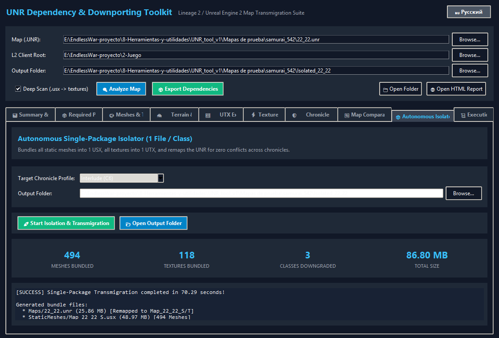
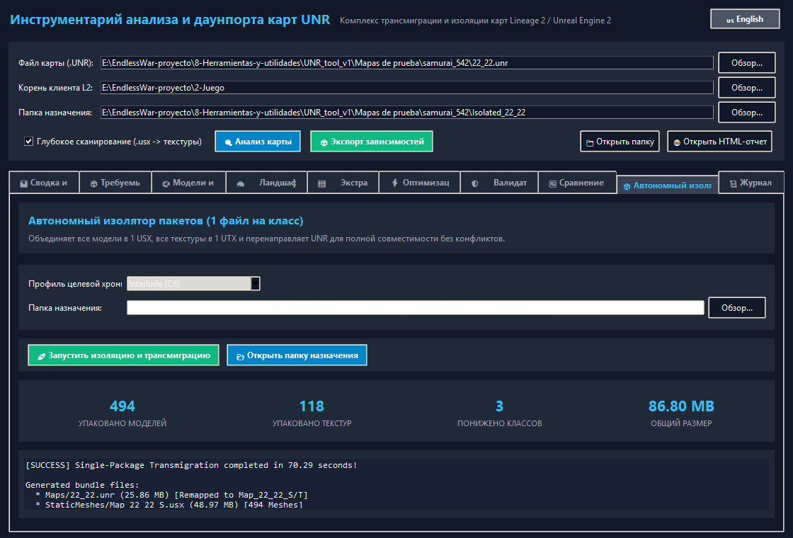
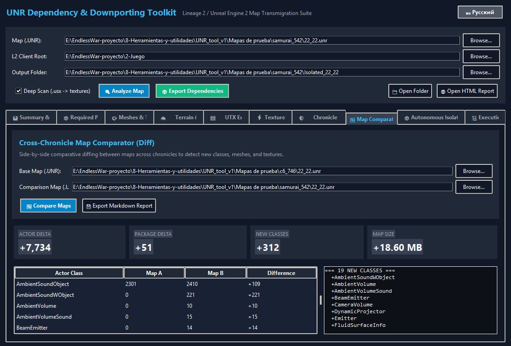
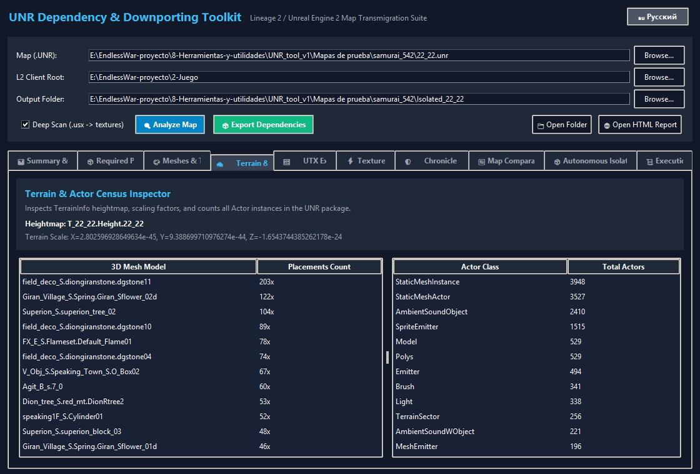
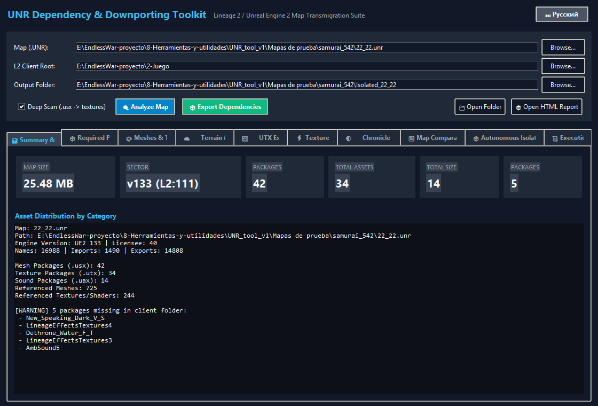

# UNR Dependency & Downporting Toolkit v1.7

[](README_RU.md)
[](LICENSE)
[]()

A complete, standalone Python toolkit to inspect, isolate, extract, adapt, compare, and transmigrate Lineage 2 Unreal Engine 2 map sectors (`.unr`), their 3D static meshes (`.usx`), and texture dependencies (`.utx`).

---

## 🌟 What's New in v1.7

### 1. Autonomous Single-Package Isolation & Transmigration (`1 File / Class`)
- **1 File Per Class**: Automatically consolidates all map static meshes into a single `Map_{SECTOR}_S.usx` and all textures/shaders/heightmaps into `Map_{SECTOR}_T.utx`.
- **UNR Import Table Remapping**: Re-routes all package lookups directly to the consolidated master packages without altering actor positions, rotations, or raw geometry.
- **Zero Client Conflicts**: Install custom or high-chronicle maps into any client without overwriting retail packages (`Goddard_S`, `Aden_S`, `Giran_Village_S`, etc.).
- **Automatic Class Downgrade & Chronicle Patching**: Automatically converts package headers (`v123`, `lic 28/37`) and downports modern engine classes (`Spotlight` $\rightarrow$ `Light`, `AmbientSoundWObject` $\rightarrow$ `AmbientSound`, `DynamicProjector` $\rightarrow$ `Projector`).

### 2. Full English & Russian Localization (i18n)
- 1-click toggle directly in the header banner: `[ 🇷🇺 Русский ]` / `[ 🇺🇸 English ]`.
- All 10 tabs, metrics, table columns, dialogs, and reports support authentic English and Russian modding terminology.

### 3. Cross-Chronicle Map Comparator & Differ
- Side-by-side comparative diffing between maps with actor count deltas, added classes, package changes, and automated Markdown reports.

### 4. Native UTX Texture Extractor
- Direct extraction of DXT1, DXT3, DXT5, RGBA8, and G16 textures into native `.dds` and `.png` files without external tools.

### 5. Terrain & Actor Placement Census
- Extracts `TerrainInfo` heightmaps, scaling factors, and comprehensive actor instance counts.

---

## 📸 Interface Gallery

### 1. Autonomous Single-Package Isolator (1/Class)

*English Interface: 494 meshes and 118 textures bundled in 70s with zero external package conflicts.*


*Интерфейс на русском языке: автономный комплект из 3 файлов (.unr, .usx, .utx).*

### 2. Cross-Chronicle Map Comparator (Diff)

*Comparing C6 (Interlude) vs Samurai: actor deltas, mesh differences, and new modern classes.*

### 3. Terrain & Actor Placement Census

*Detailed breakdown of heightmap textures, scaling factors, and StaticMesh placements.*

### 4. Dependency Summary & Metrics

*Real-time package metrics, engine versions, and asset category distribution.*

---

## 📁 Repository Structure

```text
UNR_tool_v1/
├── l2_crypt.py           # Decryption/encryption for Lineage 2 package headers (111/413)
├── ue2_package.py        # Low-level UE2 package parser and serializer
├── i18n.py               # Internationalization engine (English & Russian)
├── unr_analyzer.py       # High-level map dependency analyzer
├── utx_extractor.py      # Native UTX texture extractor (DDS & PNG)
├── terrain_inspector.py  # TerrainInfo & StaticMesh placement inspector
├── engine_validator.py   # Cross-chronicle compatibility validator (C4 / Interlude / H5 / Classic)
├── map_comparator.py     # Cross-chronicle map differ and delta analyzer
├── unr_remapper.py       # UNR import table remapper & chronicle downgrader
├── utx_consolidator.py   # Consolidates all map textures into 1 master Map_{NAME}_T.utx
├── usx_consolidator.py   # Consolidates all map static meshes into 1 master Map_{NAME}_S.usx
├── map_isolator.py       # Master orchestrator for Single-Package Map Transmigration
├── asset_collector.py    # Asset copier and folder organizer
├── texture_optimizer.py  # Image batch resizer and Power-of-Two clamping
├── manifest_generator.py # JSON, HTML, and Markdown report generators
├── cli.py                # Command-Line Interface entry point (v1.7)
├── gui.py                # Tkinter Graphical User Interface with bilingual EN/RU support
├── capture_gui_screenshots.py # Automated high-res screenshot capture tool
├── run_gui.bat           # 1-click Windows launcher for GUI
├── run_cli_example.bat   # Example CLI execution batch file
├── docs/screenshots/     # UI Screenshots in English and Russian
├── README.md             # English documentation
└── README_RU.md          # Russian documentation (Русская документация)
```

---

## 🚀 Getting Started

### GUI Mode (`run_gui.bat`)

Double-click `run_gui.bat` to launch the modern dark-themed application:

1. **Map (.UNR):** Choose the map you wish to inspect or transmigrate.
2. **L2 Client Root:** Path to game client (defaults to `E:\EndlessWar-proyecto\2-Juego`).
3. **Output Folder:** Target directory for generated packages and reports.
4. **Language Toggle:** Click `[ 🇷🇺 Русский ]` / `[ 🇺🇸 English ]` in the top right to switch language dynamically.

#### Available Tabs:
* **📊 Summary & Metrics:** Overall map size, engine versions, and dependency statistics.
* **📦 Required Packages:** Complete list of `.usx`, `.utx`, and `.uax` packages with found/missing status.
* **🎨 Meshes & Textures:** Exhaustive list of all referenced 3D models and textures.
* **🏔️ Terrain & Actors:** Terrain heightmap reference, scaling factors, and actor counts.
* **🖼️ UTX Extractor:** Direct texture inspection and one-click extraction to DDS/PNG.
* **⚡ Texture Resize:** Batch downscaler for textures (1024, 512, 256) enforcing POT dimensions.
* **🛡️ Chronicle Validator:** Check compatibility against C4, Interlude, H5, or Classic.
* **🔄 Map Comparator (Diff):** Compare two maps across chronicles.
* **📦 Autonomous Isolator (1/Class):** Bundle all assets into 3 autonomous files for plug-and-play installation.
* **📜 Execution Logs:** Real-time log console.

---

### CLI Mode (`cli.py`)

```bash
# 1. Single-package transmigration & isolation for Interlude:
python cli.py -u "Maps\22_22.unr" --isolate --target-chronicle interlude

# 2. Analyze map dependencies and validate C4 compatibility:
python cli.py -u "Maps\11_21.unr" --check-compat c4 --inspect-terrain

# 3. Export all required packages into an output folder:
python cli.py -u "Maps\11_21.unr" --copy --output "Export_11_21"

# 4. Extract all textures from a UTX package to DDS and PNG:
python cli.py --extract-utx "Textures\T_texture.utx" --output "Extracted_Textures"

# 5. Compare two maps across chronicles:
python cli.py -u "Maps\c6\22_22.unr" --compare "Maps\samurai\22_22.unr"
```

---

## 📋 Requirements

- Python 3.10+
- `Pillow` (`pip install Pillow`)
- Windows 10/11 (uses standard `tkinter` for UI and native Win32 APIs for screen capture)
